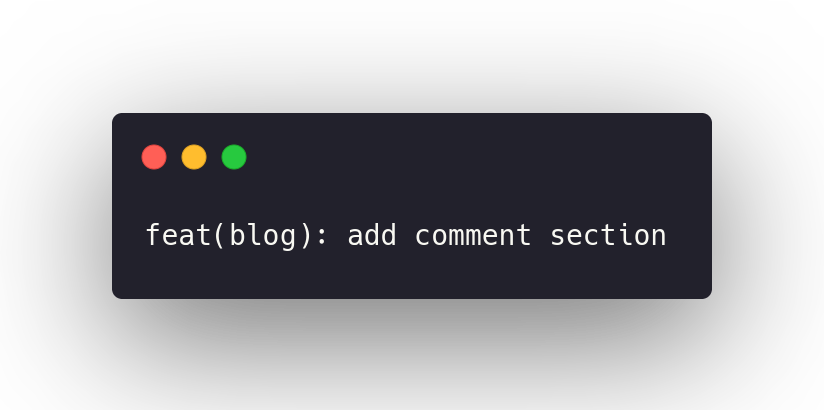
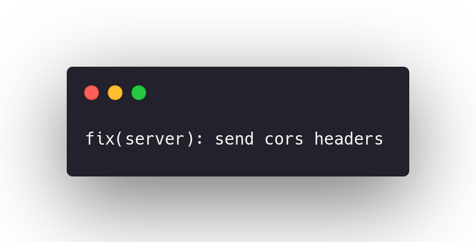

import { Head, Image, Appear } from 'mdx-deck'
import Code from 'mdx-code';
import { CodeSurfer } from "mdx-deck-code-surfer";

import { Cover } from './Cover';
import { Intro } from './Intro';
import { Img } from './Img';
import { Thanks } from './Thanks';
import { Feedback } from './Feedback';

export { default as theme } from './theme'

<Head>
  <title>FullStack Journey</title>
</Head>

<Cover />

---

<Intro />

---

# Overview

<ul>
    <Appear>
        <li>
            Dev Junior
        </li>
        <li>
            Code Organization
        </li>
        <li>
            Study Routine
        </li>
         <li>
            Feedbacks
        </li>
        <li>
            FullStack
        </li>
    </Appear>
</ul>

---

# What is a Dev Junior ?

Junior Developers are beginners and have a little more experience than an trainee

---

# Intern vs Dev Jr

What are the differences and how a trainee can evolve to junior?

---

### A fish can’t see the water

###### [Photo Unsplash Fish](https://unsplash.com/photos/kIrSG5VDdl8)

---

# Code Organization
Work on issues, branches, pull requests

---

# commitlint

commitlint checks if your commit messages meet the conventional commit format.

---

# Real world examples

---

# Real world examples 

---

# Real world examples 

---

# Study Routine
<ul>
    <Appear>
        <li>
            Study all at once
        </li>
        <li>
            List the things you have yet to learn and that you want to learn
        </li>
        <li>
            Find a mentor or a community
        </li>
         <li>
            Learn in Public
        </li>
        <li>
            CONSTANCE
        </li>
    </Appear>
</ul>

---

# FullStack

<ul>
    <Appear>
        <li>
            Why become ?
        </li>
        <li>
            What are the advantages ?
        </li>
        <li>
            What are the disadvantages?
        </li>
    </Appear>
</ul>

---

## References
- [A fish can’t see the water](https://blogs.timesofisrael.com/a-fish-cant-see-the-water/)
- [commitlint](https://github.com/conventional-changelog/commitlint#what-is-commitlint)
- [Skin in the Game for Developers](https://sibelius.substack.com/p/skin-in-the-game-for-developers)

---

<Thanks />

---

<Feedback />